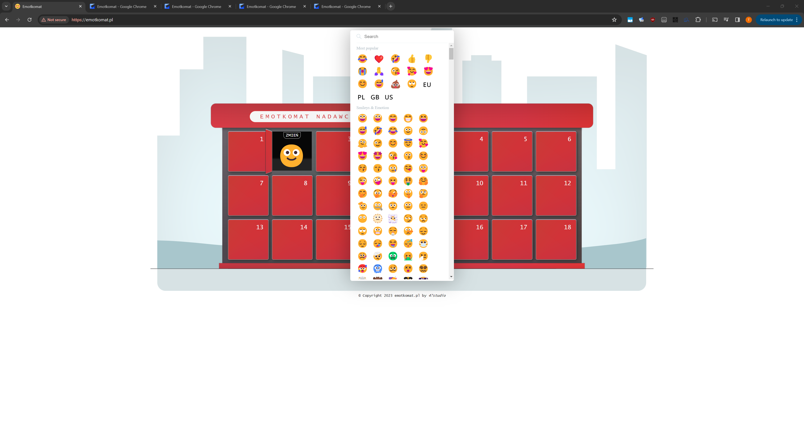
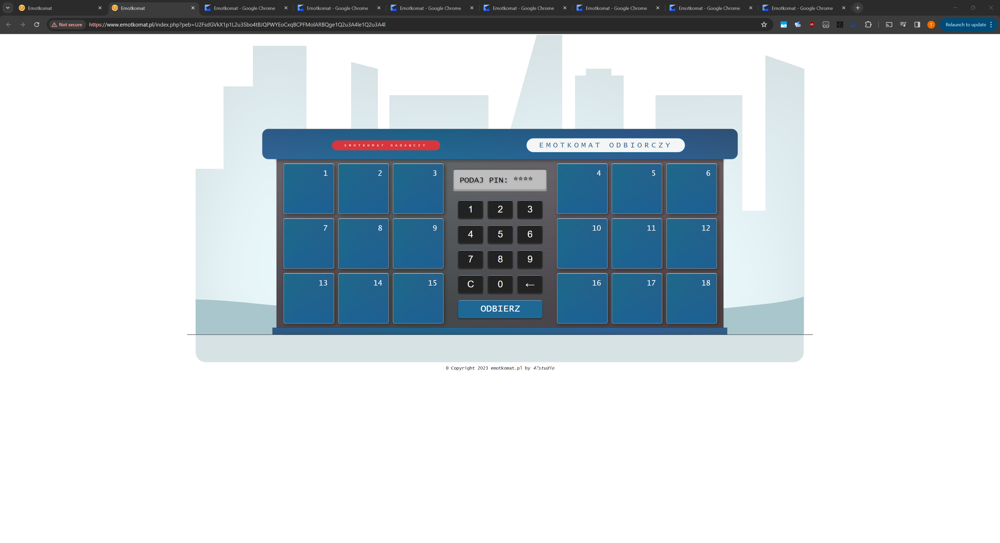

# Emotkomat

An emoji vending machine. Pick a locker, set a PIN, and send an emoji — share the link and PIN so a friend can open the matching locker and collect it.

> Emotkomat was live at `emotkomat.pl` in 2021. The domain and hosting have since been let go; this repo preserves the project.

## How it works

- Pick a numbered locker ("skrytka")
- Choose an emoji from the picker
- Set a 4-digit PIN
- Get a shareable link + PIN — opening the link and entering the PIN unlocks the matching locker and reveals the emoji

## Structure

- Root (`index.php`, `index.js`, `style.css`, `emojis.php`) — the final, deployed version of the app
- `legacy/` — the original vanilla JS/HTML prototype this grew from (Oct–Dec 2021), kept for history. See `legacy/emotkomat.php` for an even earlier, pre-jQuery first attempt.

## Demo

| Sending (nadawczy) | Receiving (odbiorczy) |
|---|---|
|  |  |

|  |
|---|
|  |

## Credits

- Emoji picker UI adapted from [a CodePen by Tu Truong](https://codepen.io/lufutu/pen/gWygjW), MIT licensed. License text included in `software.php`.
- Favicon generated from [Twemoji](https://github.com/twitter/twemoji) (`1f60a.svg`), © Twitter, Inc. and contributors, CC-BY 4.0.
